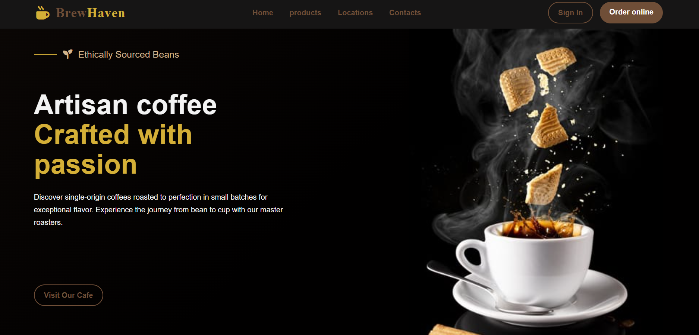
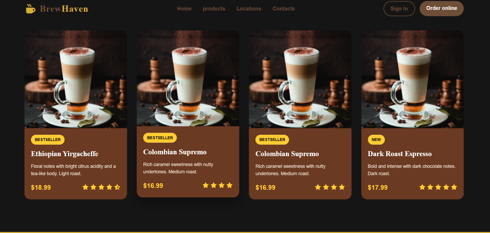
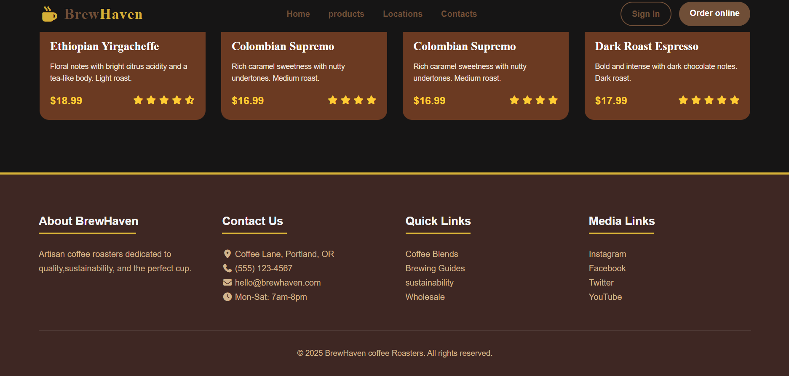

# ☕ BrewHaven — Coffee Shop Landing Page

A modern and stylish coffee shop landing page built with **HTML, CSS, and JavaScript** and hosted on GitHub Pages.

Live Demo: https://deepaktecz.github.io/Coffee-website/

---

## 🌟 Features

- 📱 Clean, premium UI inspired by real coffee brand designs  
- 🖼️ Hero section with tagline and call-to-action  
- ☕ Product cards showcasing signature coffee blends  
- 📜 About & Contact sections with real-like info  
- 📍 Navigation bar and footer with quick links  

---

## 🛠️ Built With

- **HTML5** — Structure and content  
- **CSS3** — Styling and layout  
- **JavaScript** — Interactive behaviors *(if present)*  
- **GitHub Pages** — Deployment  

---

## 📌 Usage

You can reuse and customize this project to build your own coffee shop landing page or front-end portfolio project. Add your own images, product names, pricing, and contact details.

---

## 📷 Preview

---

## 📝 License

This project is open-source and available for anyone to use and modify..
